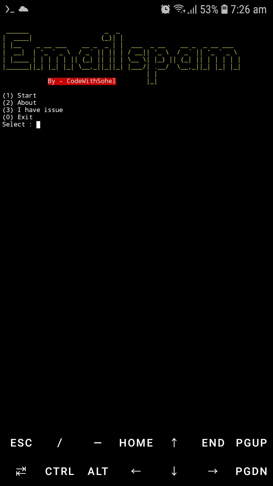
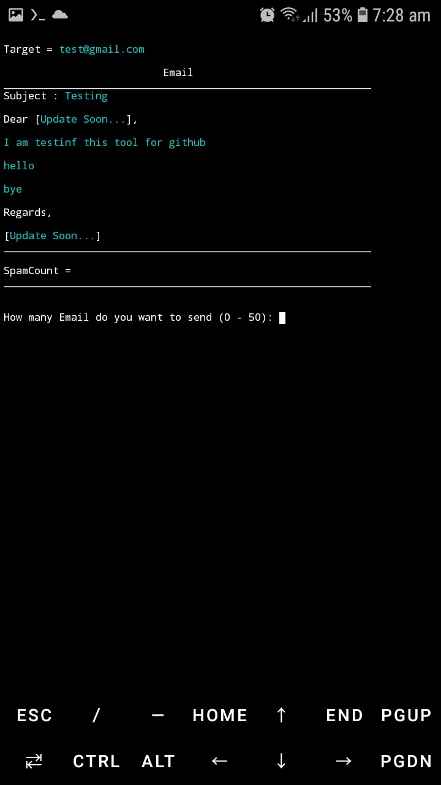
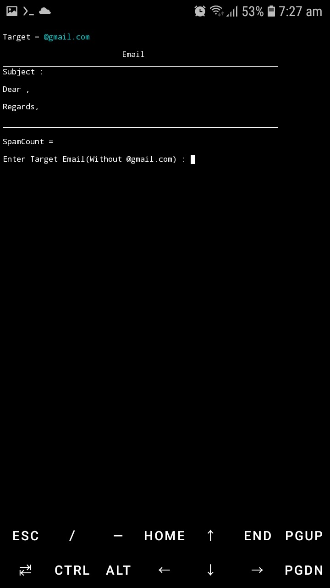
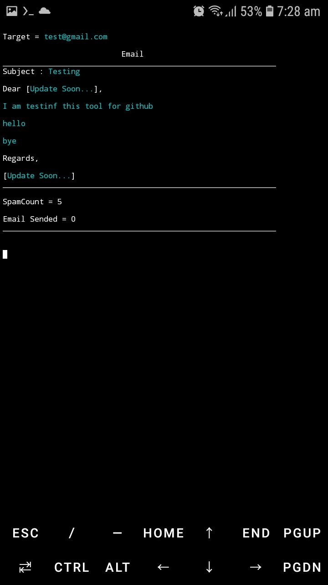

# Email-Spam

## Installation

1. Clone the repository:
    ```bash
    git clone https://github.com/yourusername/Email-Spam.git
    ```

2. Navigate to the Email-Spam directory:
    ```bash
    cd Email-Spam
    ```

3. Make the installation script executable:
    ```bash
    chmod +x install.sh
    ```

4. Run the installation script:
    ```bash
    ./install.sh
    ```

## Description

Email-Spam is a tool designed for educational purposes to demonstrate the mechanics of email spamming. It allows users to customize email content and parameters for simulated spamming scenarios. This tool is intended to be used responsibly and ethically, and users should only use it with the consent of all parties involved.

**Note:** This tool is solely for educational purposes and should not be used for any malicious or illegal activities.

## Screenshots





